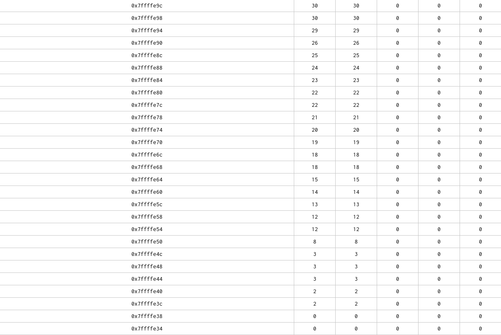

## RISC-V Tool Chain

### Ripes

La table des symboles donnée par `objdump` indique que `input` se situe dans la section `.data` à l'adresse `0x111c8`.
On retrouve cet emplacement dans l'onglet Memory de Ripes :


Le transfert de `input` dans `buffer` (qui se situe dans la stack) se fait au début de main :

```
   10130:	0007a683          	lw	a3,0(a5)
   10134:	00d72023          	sw	a3,0(a4)
   10138:	00478793          	addi	a5,a5,4
   1013c:	00470713          	addi	a4,a4,4
   10140:	fec798e3          	bne	a5,a2,10130 <main+0x2c>
```

L'instruction `lw` charge la valeur depuis la mémoire pour que `sw` la restocke dans la stack. On peut donc déterminer l'emplacement de la stack (et vérifier l'emplacement de `input`) en regardant les valeurs des registres `a4` et `a5` lors de la première itération.


L'alogrithme cherche de manière linéaire la plus petite valeur de la liste et l'échange avec l'indice courant. Lors de la première itération on s'attend alors à ce que la valeur `60` à l'adresse `0x7ffffe34` soit échangée avec le `0` à l'adresse `0x7fffed0`.


On peut vérifier à la sortie du programme.



C'est d'une beauté sublime et nous pouvons nous dire que c'est mignon de voir des cases bouger en mémoire. Pour la gestion du cache, les essais seront réalisés à la partie 5 du projet.


Enfin nous comparons les caractéristiques d'exécution d'un processeur RISC-V à 5 étages de pipelines et d'un processeur à double pipeline à 6 étages.


**Caractéristiques d'exécution 5-stage pipeline**: Le programme prend 58998 cycles à s'exécuter. 
La plupart de ces cycles sont dédiés aux instructions de la boucle du programme 
appelant la fonction `minIndex`. On a un CPI de 1,38 et un IPC de 0,725

**Caractéristiques d'exécution 6-stage dual-issue**: Le programme prend 53943 cycles à s'exécuter. 
La plupart de ces cycles sont dédiés aux instructions de la boucle du programme 
appelant la fonction `minIndex`. On a un CPI de 1,26 et un IPC de 0,793

Remarquons qu'exécuter deux instructions simultanément offre une accélération un peu décevante. En effet le tri par insertion n'est pas adapté à la parallélisation : chaque étape dépend de la précédente et la recherche du minimum n'est également pas parallélisée...