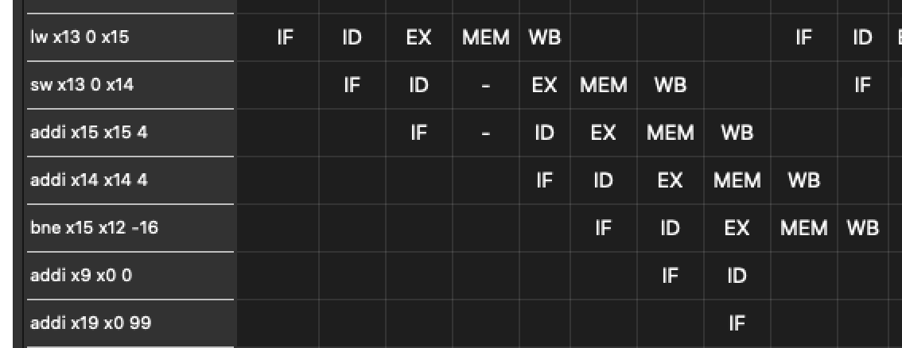

## Simple Pipelining

Le processeur utilisé pour la simulation **implémente le forwarding**, on peut le voir 
pendant l'exécution des instructions de la boucle mentionnée précédemment : 

\

On peut voir que l'instruction `sw x13, 0, x14` n'attend pas que l'instruction précédente 
arrive au stage `WB` pour s'exécuter. On peut déduire du nombre de `stall` que le processeur implémente le forwarding de l'étape `MEM` vers l'étape `EX`. Dans le cas ou le forward était implémeté à l'étape `EX` (juste après le calcul de l'ALU), il n'y aurait eu aucun cycle de 
`stalling`.

Dans la partie _Adapting Compiler Explorer generated RISC V assembly code_, on nous donne 
des indications afin d'adapter un programme traditionnel en un programme compatible avec 
la simulation. Pour terminer un programme, un label `end` est ajouté à la fin du fichier. 
On ajoute également un saut inconditionnel vers ce label après l'exécution de notre code. 
Ci-dessous l'exemple fourni de la documentation:

```
.data
arg:
	.word 7

.text
main:
        lw       a0, arg
        jal      ra, fact
        jal      zero, end 	         # <- inconditionnal jump, zero being an alias for x0
fact:
        addi    sp, sp, -16
        sw      ra, 12(sp)
        sw      s1, 8(sp)
        sw      s2, 4(sp)
        mv      s2, a0
        addi    a0, zero, 1
        blt     s2, a0, .LBB0_3
        addi    a0, zero, 1
        mv      s1, zero
.LBB0_2:
        addi    s1, s1, 1
        mv      a1, s1
        mul     a0, a0, a1
        bne     s2, s1, .LBB0_2
.LBB0_3:
        lw      s2, 4(sp)
        lw      s1, 8(sp)
        lw      ra, 12(sp)
        addi    sp, sp, 16
        ret
end:                                 # <- file-ending label
```

