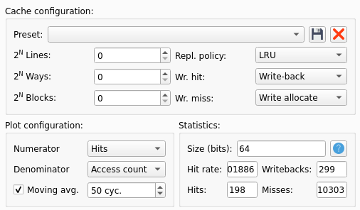
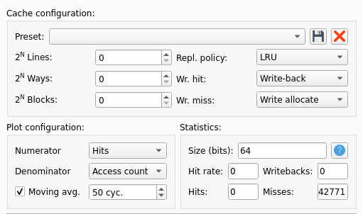
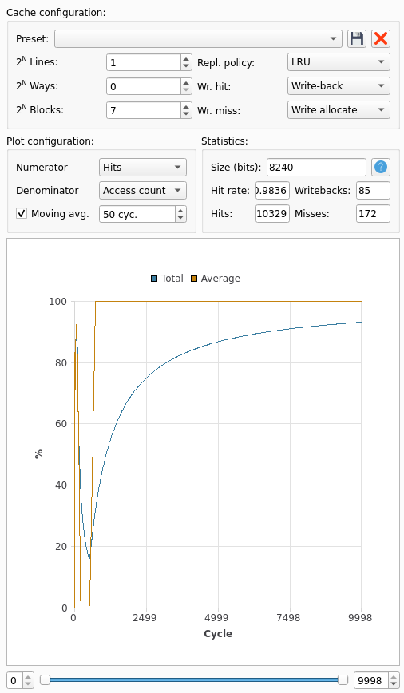
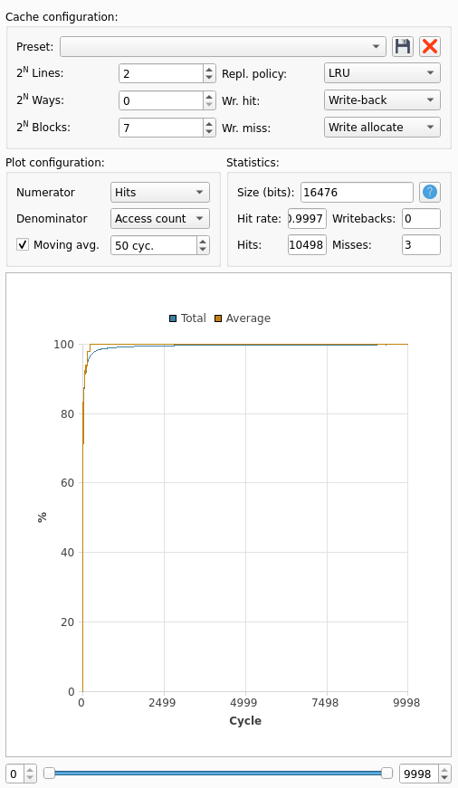
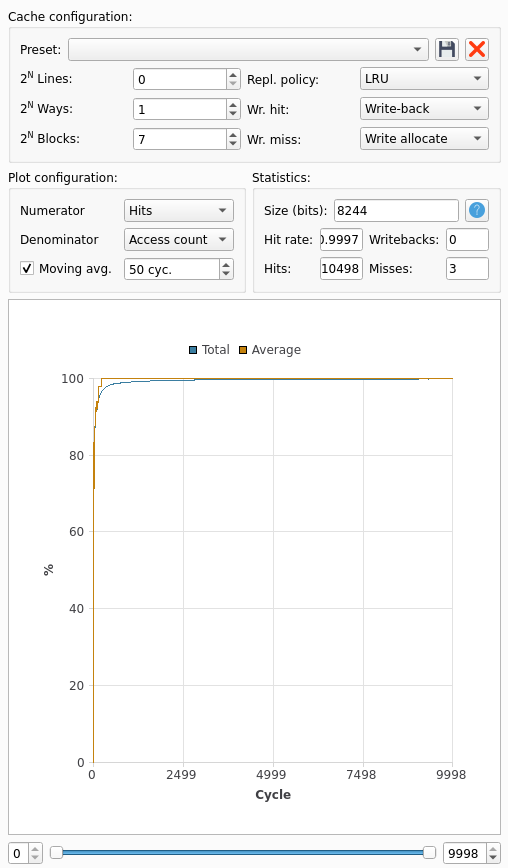
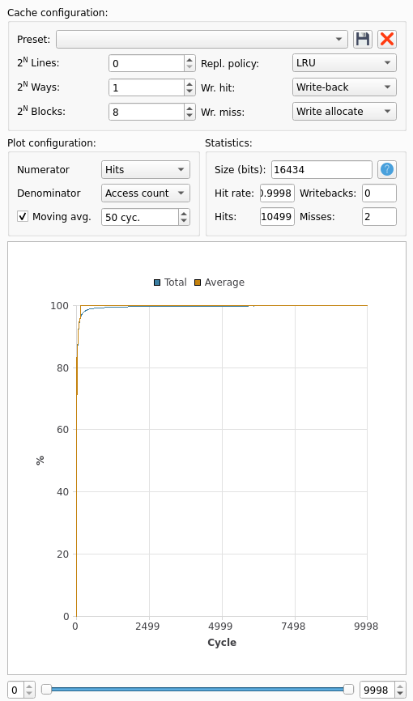
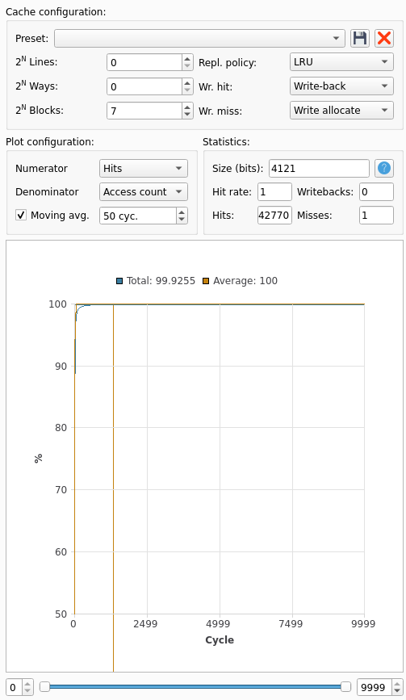

## Caches

Déterminons le nombre d'_instruction fetches_ à partir du code désassemblé.

`_start` exécute 5 instruction (arrêt de Ripes à l'instruction `ecall`), dont un saut inconditionnnel sur `main`.

```
000101a8 <_start>:
   101a8:	ff010113          	addi	sp,sp,-16
   101ac:	00112623          	sw	ra,12(sp)
   101b0:	f55ff0ef          	jal	ra,10104 <main>
   101b4:	00a00893          	li	a7,10
   101b8:	00000073          	ecall
```

`main` commence par 11 instructions pour initialiser la stack et les adresses dans les registres `a4` et `a5` et la boucle de copie de `input` dans `buffer`.

```
00010104 <main>:
   10104:	e5010113          	addi	sp,sp,-432
   10108:	1a112623          	sw	ra,428(sp)
   1010c:	1a812423          	sw	s0,424(sp)
   10110:	1a912223          	sw	s1,420(sp)
   10114:	1b212023          	sw	s2,416(sp)
   10118:	19312e23          	sw	s3,412(sp)
   1011c:	000117b7          	lui	a5,0x11
   10120:	1c878793          	addi	a5,a5,456 # 111c8 <input>
   10124:	00410413          	addi	s0,sp,4
   10128:	18c78613          	addi	a2,a5,396
   1012c:	00040713          	mv	a4,s0
```

Elle exécute ensuite pour chaque élément de `input` 5 instructions, donc 99 fois.

```
   10130:	0007a683          	lw	a3,0(a5)
   10134:	00d72023          	sw	a3,0(a4)
   10138:	00478793          	addi	a5,a5,4
   1013c:	00470713          	addi	a4,a4,4
   10140:	fec798e3          	bne	a5,a2,10130 <main+0x2c>
```

Elle initialise ensuite la boucle de tri en 5 instructions :

```
   10144:	00000493          	li	s1,0
   10148:	06300993          	li	s3,99
   1014c:	06200913          	li	s2,98
   10150:	409985b3          	sub	a1,s3,s1
   10154:	00040513          	mv	a0,s0
```

Elle effectue ensuite la boucle de tri (12 instructions, 98 fois) :

```
   10158:	f61ff0ef          	jal	ra,100b8 <minIndex>
   1015c:	00950533          	add	a0,a0,s1
   10160:	00251513          	slli	a0,a0,0x2
   10164:	19010793          	addi	a5,sp,400
   10168:	00a78533          	add	a0,a5,a0
   1016c:	e7452783          	lw	a5,-396(a0)
   10170:	00042703          	lw	a4,0(s0)
   10174:	e6e52a23          	sw	a4,-396(a0)
   10178:	00f42023          	sw	a5,0(s0)
   1017c:	00148493          	addi	s1,s1,1
   10180:	00440413          	addi	s0,s0,4
   10184:	fd2496e3          	bne	s1,s2,10150 <main+0x4c>
```

Enfin elle dépile et retourne, 8 instructions :

```
   10188:	00412503          	lw	a0,4(sp)
   1018c:	1ac12083          	lw	ra,428(sp)
   10190:	1a812403          	lw	s0,424(sp)
   10194:	1a412483          	lw	s1,420(sp)
   10198:	1a012903          	lw	s2,416(sp)
   1019c:	19c12983          	lw	s3,412(sp)
   101a0:	1b010113          	addi	sp,sp,432
   101a4:	00008067          	ret
```

Dans la boucle de tri, la fonction `minIndex` est appelée. Cette dernière contient, 19 instructions dont 6 qui bouclent 99, 98, 97, etc. fois :

```
   100d8:	02e58063          	beq	a1,a4,100f8 <minIndex+0x40>
   100dc:	00251793          	slli	a5,a0,0x2
   100e0:	00f807b3          	add	a5,a6,a5
   100e4:	0006a603          	lw	a2,0(a3)
   100e8:	0007a783          	lw	a5,0(a5)
   100ec:	fef652e3          	ble	a5,a2,100d0 <minIndex+0x18>
```

Notons également que chaque saut ajoute 2 instruction fetches car le processeur, même s'il flush des instructions, les a tout de même cherché dans la mémoire.

On somme tout : 5 + 11 + ((5+2) * 99) + 5 + (98 * (12 + 2 + 13 + 2)) + somme(1, ..., 99) * (6+2) + 8 = 42372 instruction fetches

Concernant les accès mémoires, on en a 10 à l'empilement/dépilement de `main`, 1 à `_start`, 2 par itération de la boucle de `minIndex` (soit 2 * somme(1, ..., 99) au total, 2 par itération de la boucle de copie au début de `main`, 4 par itération de la boucle de tri.

On somme tout : 11 + 2 * somme(1, ..., 99) + 2 * 99 + 4 * 98 = 601 + 9702 = 10303 data fetches

Mais finalement nous n'avons qu'une soixantaine d'instructions : le nombre de fetches résulte des quelques très grandes boucles qui sont effectuées dans le programme. De plus ces adresses sont spatialement contigües : on n'est pas obligé d'aller les chercher en mémoire à chaque fois.

De même les données consistent principalement en un tableau présent dans `.data` puis dans la stack. Cela pour un total de seulement 198 mots, et seulement 2 zones éloignées en mémoire.

Pour valider nos calculs, nous pouvons prendre des caches à une seule ligne et un seul bloc : tous les fetches résulteront en des miss.

Regardons pour les _data fetches_ :



Nous avions bien calculé !

Et pour les _instruction fetches_ :



On n'est franchement pas loin... Déjà nous avons oublié de compter les 2 instructions cherchées à cause du saut sur `minIndex`. En les ajoutant, on obtient 42568. Les retours provoquent aussi ces 2 instructions, en particulier le retour de la fonction `minIndex` : on ajoute et on obtient 42764.

Pour le reste, les retours de la fonction `main`, les cas particuliers de fin de boucle avec une branche finalement non prise peuvent expliquer notre écart.


### Optimisation du cache

Pour optimiser les accès en mémoire, nous cherchons à tout avoir dans le cache. Commençons par le cache de données.
Pour ce dernier il faut prévoir deux zones : la section `.data`, de taille `0x190 (400)` octets (100 mots mémoire) et la stack qui sera de `432` octets (108 mots mémoire). Ces deux zones sont amenées à être utilisées simultanément lors de la copie de `input` dans `buffer` : on doit donc prévoir assez de place pour les loger toutes les deux.

Afin de réduire le nombre de _compulsory misses_, nous prendrons des lignes de très grande capacité : une ligne sera idéalement capable de contenir toute une zone. Cela évite d'avoir dans la boucle de copie par exemple, le chargement d'une nouvelle ligne car on n'avait pas pu tout charger la première fois. Nous envisageons deux lignes de `128 blocks`.



On a énormément de miss. On observe en exécutant pas à pas que le tag de la deuxième change régulièrement entre `0x44` et `0x1fffff` à partir d'un moment dans la copie. Il s'agit de _conflict misses_ : à un certain moment le cache mappe sur la même ligne `input` et `buffer`. Ces derniers étant accédés l'un après l'autre, on perd énormément. Après cela, plus aucun _miss_ : `input` n'est plus utilisé, on n'a besoin que de la stack et tout se passe bien.

On remarque donc également que `.data` ne rentre pas dans une ligne de `128 blocks`.

Réglons d'abord le problème principal, à savoir le _conflict miss_. Pour cela on peut ajouter des lignes.



Cela fonctionne mais on peut faire encore mieux : utiliser un _2-way associative cache_ avec une seule ligne :



Pour régler le problème du 3ème _miss_, la solution serait soit d'aligner `.data` autrement (mais nous n'avons pas forcément envie de recompiler pour ce projet), soit d'augmenter la taille de la ligne afin que `.data` rentre en une seule fois dans la ligne, ne nous obligeant pas à charger sa deuxième partie durant la copie: 



On augmente d'un facteur 2 la taille du cache pour résoudre 1 _miss_. Tout dépend de l'application : si on veut réduire la taille ou le coût on préférera garder 3 _misses_, si les performances sont cruciales et que l'on ne peut se permettre d'attendre un accès mémoire, on fera ce sacrifice en taille.

Concernant la métrique on préférera une métrique, la métrique _random_ ne garantit pas que les _misses_ n'augmenteront pas alors que la métrique _LRU_ le garantit : on préférera cette dernière, quitte à obtenir une implémentation plus coûteuse.


Concernant le cache d'instruction, nous avons 65 instructions seulement à stocker (`minIndex` commence en `0x100b8` et `ecall` se trouve en `0x101b8`, menant à 264 mots mémoire. Nous pouvons prévoir une ligne unique de `128 blocks` :



Ici la métrique importe peu, puisqu'un seul fetch sera nécessaire : la taille de la ligne suffit à stocker toutes les instructions.

Notons que dans le cas des données, il nous faut au moins 2 _misses_ : un pour l'accès à `.data` et l'autre pour l'accès à la stack. Les zones mémoire sont trop éloignées pour les charger en même temps sans faire un cache totalement démesuré.


Dans ce programme la plupart des données sont accédées via des boucles : on a une proximité temporelle favorable à l'utilisation d'une politique LRU par exemple. De plus, comme on accède à des tableaux, on a également une proximité spatiale. Un cache _direct mapped_ pourrait donc être efficace, même si nous avons décidé ici de réduire au minimum le nombre de _misses_.

Idem pour les instructions, même si maintenant la question ne se pose plus : nous les avons toutes chargées d'un seul coup.


Illustrons les différents types de conflits avec un cache de données _2-way associative_, 2 lignes, _16 blocks_. Nous choisissons volontairement un cache trop petit pour y faire rentrer tout le tableau, afin que nous puissions observer des _capacity misses_. Ces derniers se manifestent alors par des _changements de tag_.