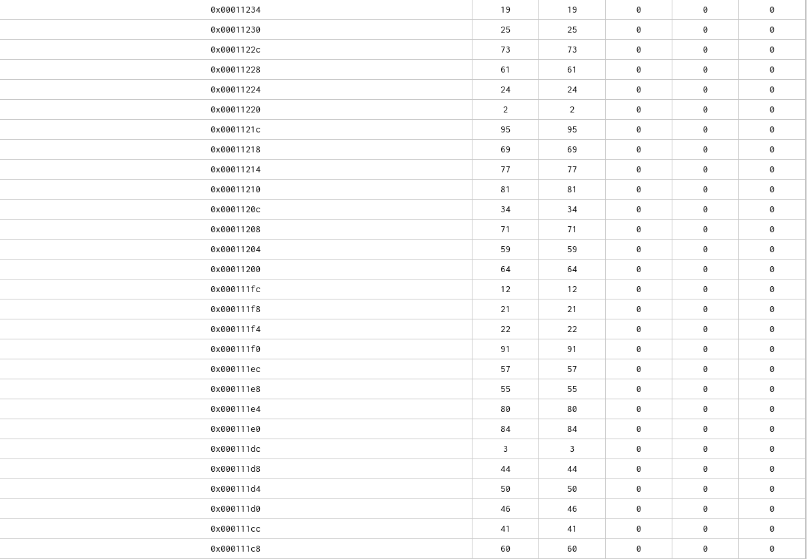
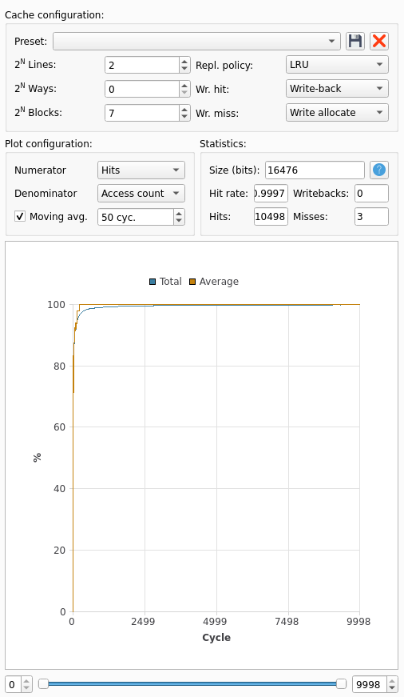
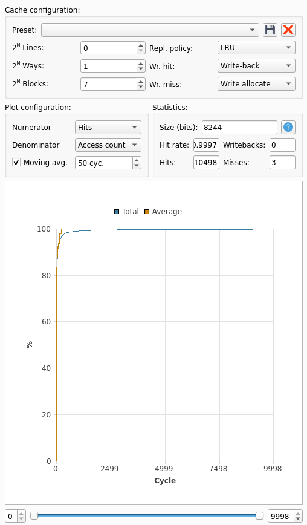
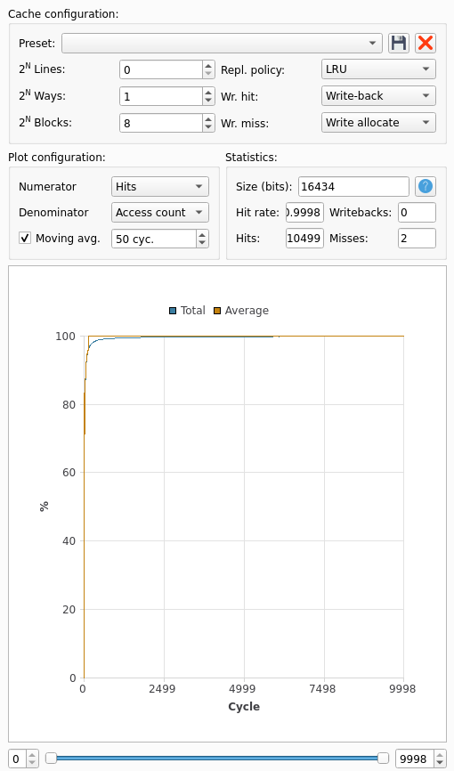

---
title: 'SE201 : Projet 1'
author: Florian Tarazona, Isaïe Muron, Lucie Molinié
...

\newpage

## RISC-V Tool Chain

### RISC-V Tools

Lorsque l'on lance le Makefile (`$make`), on fait appel au compilateur gcc pour architecture RISC-V.

- L'option `-nostdlib` retire les fichiers objets des librairies systèmes/des fichiers liés au démarrage lors de l'étape de link. Entre autres, les seuls 
fichiers considérés sont ceux spécifiés explicitement.
- L'option `-nostartfile` est similaire à l'option précédente, mais ne concerne que les fichiers liés au démarrage du programme (par exemple, 
les fichiers du type `crtX.o`).


On peut désassembler le fichier `.elf` résultant en utilisant `objdump` (cf. Makefile, ajout d'une cible `assembly`), on obtient le code assembleur suivant :

```
Déassemblage de la section .text :

000100d8 <minIndex>:
   100d8:	00050813          	mv	a6,a0
   100dc:	04b05063          	blez	a1,1011c <minIndex+0x44>
   100e0:	00050693          	mv	a3,a0
   100e4:	00000513          	li	a0,0
   100e8:	00000713          	li	a4,0
   100ec:	0100006f          	j	100fc <minIndex+0x24>
   100f0:	00170713          	addi	a4,a4,1
   100f4:	00468693          	addi	a3,a3,4
   100f8:	02e58063          	beq	a1,a4,10118 <minIndex+0x40>
   100fc:	00251793          	slli	a5,a0,0x2
   10100:	00f807b3          	add	a5,a6,a5
   10104:	0006a603          	lw	a2,0(a3)
   10108:	0007a783          	lw	a5,0(a5)
   1010c:	fef652e3          	bge	a2,a5,100f0 <minIndex+0x18>
   10110:	00070513          	mv	a0,a4
   10114:	fddff06f          	j	100f0 <minIndex+0x18>
   10118:	00008067          	ret
   1011c:	00000513          	li	a0,0
   10120:	00008067          	ret

00010124 <main>:
   10124:	e5010113          	addi	sp,sp,-432
   10128:	1a112623          	sw	ra,428(sp)
   1012c:	1a812423          	sw	s0,424(sp)
   10130:	1a912223          	sw	s1,420(sp)
   10134:	1b212023          	sw	s2,416(sp)
   10138:	19312e23          	sw	s3,412(sp)
   1013c:	000117b7          	lui	a5,0x11
   10140:	1e878793          	addi	a5,a5,488 # 111e8 <input>
   10144:	00410413          	addi	s0,sp,4
   10148:	18c78613          	addi	a2,a5,396
   1014c:	00040713          	mv	a4,s0
   10150:	0007a683          	lw	a3,0(a5)
   10154:	00d72023          	sw	a3,0(a4)
   10158:	00478793          	addi	a5,a5,4
   1015c:	00470713          	addi	a4,a4,4
   10160:	fec798e3          	bne	a5,a2,10150 <main+0x2c>
   10164:	00000493          	li	s1,0
   10168:	06300993          	li	s3,99
   1016c:	06200913          	li	s2,98
   10170:	409985b3          	sub	a1,s3,s1
   10174:	00040513          	mv	a0,s0
   10178:	f61ff0ef          	jal	ra,100d8 <minIndex>
   1017c:	00950533          	add	a0,a0,s1
   10180:	00251513          	slli	a0,a0,0x2
   10184:	19010793          	addi	a5,sp,400
   10188:	00a78533          	add	a0,a5,a0
   1018c:	e7452783          	lw	a5,-396(a0)
   10190:	00042703          	lw	a4,0(s0)
   10194:	e6e52a23          	sw	a4,-396(a0)
   10198:	00f42023          	sw	a5,0(s0)
   1019c:	00148493          	addi	s1,s1,1
   101a0:	00440413          	addi	s0,s0,4
   101a4:	fd2496e3          	bne	s1,s2,10170 <main+0x4c>
   101a8:	00412503          	lw	a0,4(sp)
   101ac:	1ac12083          	lw	ra,428(sp)
   101b0:	1a812403          	lw	s0,424(sp)
   101b4:	1a412483          	lw	s1,420(sp)
   101b8:	1a012903          	lw	s2,416(sp)
   101bc:	19c12983          	lw	s3,412(sp)
   101c0:	1b010113          	addi	sp,sp,432
   101c4:	00008067          	ret

000101c8 <_start>:
   101c8:	ff010113          	addi	sp,sp,-16
   101cc:	00112623          	sw	ra,12(sp)
   101d0:	f55ff0ef          	jal	ra,10124 <main>
   101d4:	00a00893          	li	a7,10
   101d8:	00000073          	ecall
   101dc:	00c12083          	lw	ra,12(sp)
   101e0:	01010113          	addi	sp,sp,16
   101e4:	00008067          	ret

```

Le symbole `_start` correspond au code qui viendrait habituellement d'un fichier `crtX.s`. Le code de la première boucle du programme commence à l'adresse `0x1013c` et fini en `0x10154` :

```

   1013c:       000117b7                lui     a5,0x11
   10140:       1e878793                addi    a5,a5,488 # 111e8 <input>
   10144:       00410413                addi    s0,sp,4
   10148:       18c78613                addi    a2,a5,396
   1014c:       00040713                mv      a4,s0
   10150:       0007a683                lw      a3,0(a5)
   10154:       00d72023                sw      a3,0(a4)

```

Toujours à l'aide de `objdump`, on peut obtenir une liste des symboles générés:

```

insertion-sort.elf:     format de fichier elf32-littleriscv

SYMBOL TABLE:
000100d8 l    d  .text	00000000 .text
000111e8 l    d  .data	00000000 .data
00011378 g       .data	00000000 __SDATA_BEGIN__
000111e8 g     O .data	00000190 input
000101c8 g     F .text	00000020 _start
00011378 g       .data	00000000 __BSS_END__
00011378 g       .data	00000000 __bss_start
00010124 g     F .text	000000a4 main
000111e8 g       .data	00000000 __DATA_BEGIN__
00011378 g       .data	00000000 _edata
00011378 g       .data	00000000 _end
000100d8 g     F .text	0000004c minIndex

```

Le symbole `input` est à l'adresse `0x000111e8`. Il est utilisé par l'instruction d'adresse `0x10140`. 


Du code qualifié de _Position Independent_ est un morceau de code s'exécutant correctement indépendamment de son placement dans la mémoire. Le PIC est utile lors 
d'utilisation partagée d'un même extrait de code (par exemple des fonctions de librairies communes à deux programmes) puisqu'il permet de ne pas se soucier des 
emplacements des programmes respectifs. L'absence d'utilisation d'adresses absolues rend plus difficile la modification de la mémoire puisque l'attaquant ne connait 
pas l'adresse exacte où il doit réaliser l'injection de code / l'écriture mémoire.\
L'instruction `auipc` permet d'ajouter au `pc` un immédiat codé sur 20bits. En particulier, elle permet d'effectuer un saut sur n'importe quelle adresse de 32 bits 
lorsqu'elle est associée à l'instruction `jalr`. Cette combinaison permet, en pratique, d'accéder à toutes adresses écrites sur 32 bits à partir d'adresses relatives 
et non absolues.

Le code assembleur obtenu n'est pas _position independent_, il fait appel à des instructions utilisant des adresses absolues au lieu d'adresses relatives.
???? le dump indique des adresses absolues dans tous les cas, en particulier à la ligne `0x10178`, alors que les instructions utilisent des offsets. Traduction de objdump?
Dans le cas où c'est bien les adresses absolues qui sont utilisées, ce code n'est pas _position independent_.\
Dans tous les cas, l'utilisation de `ret` à la fin de la fonction `minIndex` se traduit par l'instruction `jalr x0, x1, 0` et l'adresse dans `x1` n'est aps une adresse relative à la position actuelle (c'est l'adresse de retour enregistrée par l'instruction d'adresse `0x10178`).


### Ripes

La table des symboles donnée par `objdump` indique que `input` se situe dans la section `.data` à l'adresse `0x111c8`.
On retrouve cet emplacement dans l'onglet Memory de Ripes :



Le transfert de `input` dans `buffer` (qui se situe dans la stack) se fait au début de main :

```
   10130:   0007a683             lw a3,0(a5)
   10134:   00d72023             sw a3,0(a4)
   10138:   00478793             addi  a5,a5,4
   1013c:   00470713             addi  a4,a4,4
   10140:   fec798e3             bne   a5,a2,10130 <main+0x2c>
```

L'instruction `lw` charge la valeur depuis la mémoire pour que `sw` la restocke dans la stack. On peut donc déterminer l'emplacement de la stack (et vérifier l'emplacement de `input`) en regardant les valeurs des registres `a4` et `a5` lors de la première itération.


L'alogrithme cherche de manière linéaire la plus petite valeur de la liste et l'échange avec l'indice courant. Lors de la première itération on s'attend alors à ce que la valeur `60` à l'adresse `0x7ffffe34` soit échangée avec le `0` à l'adresse `0x7fffed0`.


On peut vérifier à la sortie du programme.


C'est d'une beauté sublime et nous pouvons nous dire que c'est mignon de voir des cases bouger en mémoire. Pour la gestion du cache, les essais seront réalisés à la partie 5 du projet.


Enfin nous comparons les caractéristiques d'exécution d'un processeur RISC-V à 5 étages de pipelines et d'un processeur à double pipeline à 6 étages.


**Caractéristiques d'exécution 5-stage pipeline**: Le programme prend 58998 cycles à s'exécuter. 
La plupart de ces cycles sont dédiés aux instructions de la boucle du programme 
appelant la fonction `minIndex`. On a un CPI de 1,38 et un IPC de 0,725

**Caractéristiques d'exécution 6-stage dual-issue**: Le programme prend 53943 cycles à s'exécuter. 
La plupart de ces cycles sont dédiés aux instructions de la boucle du programme 
appelant la fonction `minIndex`. On a un CPI de 1,26 et un IPC de 0,793

Remarquons qu'exécuter deux instructions simultanément offre une accélération un peu décevante. En effet le tri par insertion n'est pas adapté à la parallélisation : chaque étape dépend de la précédente et la recherche du minimum n'est également pas parallélisée...


\newpage

## Simple Pipelining

Le processeur utilisé pour la simulation **implémente le forwarding**, on peut le voir 
pendant l'exécution des instructions de la boucle mentionnée précédemment : 

\

On peut voir que l'instruction `sw x13, 0, x14` n'attend pas que l'instruction précédente 
arrive au stage `WB` pour s'exécuter. On peut déduire du nombre de `stall` que le processeur implémente le forwarding de l'étape `MEM` vers l'étape `EX`. Dans le cas ou le forward était implémeté à l'étape `EX` (juste après le calcul de l'ALU), il n'y aurait eu aucun cycle de 
`stalling`.

Dans la partie _Adapting Compiler Explorer generated RISC V assembly code_, on nous donne 
des indications afin d'adapter un programme traditionnel en un programme compatible avec 
la simulation. Pour terminer un programme, un label `end` est ajouté à la fin du fichier. 
On ajoute également un saut inconditionnel vers ce label après l'exécution de notre code. 
Ci-dessous l'exemple fourni de la documentation:

```
.data
arg:
   .word 7

.text
main:
        lw       a0, arg
        jal      ra, fact
        jal      zero, end             # <- saut inconditionnel, zero étant l'alias de x0
fact:
        addi    sp, sp, -16
        sw      ra, 12(sp)
        sw      s1, 8(sp)
        sw      s2, 4(sp)
        mv      s2, a0
        addi    a0, zero, 1
        blt     s2, a0, .LBB0_3
        addi    a0, zero, 1
        mv      s1, zero
.LBB0_2:
        addi    s1, s1, 1
        mv      a1, s1
        mul     a0, a0, a1
        bne     s2, s1, .LBB0_2
.LBB0_3:
        lw      s2, 4(sp)
        lw      s1, 8(sp)
        lw      ra, 12(sp)
        addi    sp, sp, 16
        ret
end:                                 # <- label de fin de fichier
```


\newpage

## Branches and Multiple-Issue

Voici deux exemples d'instructions qui sont _flush_:

\

On peut voir que les instructions `addi x9 x0 0` et `addi x19 x0 99`  ne sont pas exécutées jusqu'au bout. En effet l'instruction précédente `bne x15 x12 -16` est arrivée au stade d'éxécution. Comme la condition est respectée, le branchement est effectuée. Les deux instructions `addi` sont interrompues et l'instruction cible du saut est initée au cycle suivant

\

Les instructions `addi` et `ecall` sont interrompues avant d'arriver à leur terme car l'instruction `jal` est au stade de l’exécution. Cette instruction permet de passer de l'initialisation du programme au programme en lui même (`<main>`).

\

Le processeur **n'implémente pas de prédiction de branche** comme le montre l'image : les deux instructions suivant `bne` sont systématiquement flush. Or, le programme passe dans cette boucle un très grand nombre de fois. Avec une prédiction de branche le processeur aurait pu anticiper le début d'une nouvelle itération de la boucle et donc éviter d'initer les deux instructions suivant la boucle. À la place, il aurait pu commencer les étapes `IF` et `ID` de la nouvelle itération pour gagner du temps et mieux utiliser ses ressources.

Le CPI idéal de ce genre de processeur (sans parallélisme) **tend vers 1** (il y a quelques cycles sans instructions effectuées au démarrage de l'exécution). On peut voir dans le programme plusieurs moments où le processeur _stall_ l'avancement du programme en attente d'une certaine valeur, en plus des _flush_ évoqués précédemment. Le processeur du cours, quant à lui, implémente une meilleure _forwarding unit_ que le processeur étudié ici. En effet, le processeur du cours permet de _forward_ les données depuis le stage `EX` et `MEM`, tandis qu'ici seul le _forwarding_ depuis `MEM` est supporté. On a donc un cycle de _stalling_ là ou le processeur du cours n'aurait pas eu de _stall_ du tout, ce qui explique la différence de CPI.

 

\newpage

## Caches

Déterminons le nombre d'_instruction fetches_ à partir du code désassemblé.

`_start` exécute 5 instruction (arrêt de Ripes à l'instruction `ecall`), dont un saut inconditionnnel sur `main`.

```
000101a8 <_start>:
   101a8:   ff010113             addi  sp,sp,-16
   101ac:   00112623             sw ra,12(sp)
   101b0:   f55ff0ef             jal   ra,10104 <main>
   101b4:   00a00893             li a7,10
   101b8:   00000073             ecall
```

`main` commence par 11 instructions pour initialiser la stack et les adresses dans les registres `a4` et `a5` et la boucle de copie de `input` dans `buffer`.

```
00010104 <main>:
   10104:   e5010113             addi  sp,sp,-432
   10108:   1a112623             sw ra,428(sp)
   1010c:   1a812423             sw s0,424(sp)
   10110:   1a912223             sw s1,420(sp)
   10114:   1b212023             sw s2,416(sp)
   10118:   19312e23             sw s3,412(sp)
   1011c:   000117b7             lui   a5,0x11
   10120:   1c878793             addi  a5,a5,456 # 111c8 <input>
   10124:   00410413             addi  s0,sp,4
   10128:   18c78613             addi  a2,a5,396
   1012c:   00040713             mv a4,s0
```

Elle exécute ensuite pour chaque élément de `input` 5 instructions, donc 99 fois.

```
   10130:   0007a683             lw a3,0(a5)
   10134:   00d72023             sw a3,0(a4)
   10138:   00478793             addi  a5,a5,4
   1013c:   00470713             addi  a4,a4,4
   10140:   fec798e3             bne   a5,a2,10130 <main+0x2c>
```

Elle initialise ensuite la boucle de tri en 5 instructions :

```
   10144:   00000493             li s1,0
   10148:   06300993             li s3,99
   1014c:   06200913             li s2,98
   10150:   409985b3             sub   a1,s3,s1
   10154:   00040513             mv a0,s0
```

Elle effectue ensuite la boucle de tri (12 instructions, 98 fois) :

```
   10158:   f61ff0ef             jal   ra,100b8 <minIndex>
   1015c:   00950533             add   a0,a0,s1
   10160:   00251513             slli  a0,a0,0x2
   10164:   19010793             addi  a5,sp,400
   10168:   00a78533             add   a0,a5,a0
   1016c:   e7452783             lw a5,-396(a0)
   10170:   00042703             lw a4,0(s0)
   10174:   e6e52a23             sw a4,-396(a0)
   10178:   00f42023             sw a5,0(s0)
   1017c:   00148493             addi  s1,s1,1
   10180:   00440413             addi  s0,s0,4
   10184:   fd2496e3             bne   s1,s2,10150 <main+0x4c>
```

Enfin elle dépile et retourne, 8 instructions :

```
   10188:   00412503             lw a0,4(sp)
   1018c:   1ac12083             lw ra,428(sp)
   10190:   1a812403             lw s0,424(sp)
   10194:   1a412483             lw s1,420(sp)
   10198:   1a012903             lw s2,416(sp)
   1019c:   19c12983             lw s3,412(sp)
   101a0:   1b010113             addi  sp,sp,432
   101a4:   00008067             ret
```

Dans la boucle de tri, la fonction `minIndex` est appelée. Cette dernière contient, 19 instructions dont 6 qui bouclent 99, 98, 97, etc. fois :

```
   100d8:   02e58063             beq   a1,a4,100f8 <minIndex+0x40>
   100dc:   00251793             slli  a5,a0,0x2
   100e0:   00f807b3             add   a5,a6,a5
   100e4:   0006a603             lw a2,0(a3)
   100e8:   0007a783             lw a5,0(a5)
   100ec:   fef652e3             ble   a5,a2,100d0 <minIndex+0x18>
```

Notons également que chaque saut ajoute 2 instruction fetches car le processeur, même s'il flush des instructions, les a tout de même cherché dans la mémoire.

On somme tout : 5 + 11 + ((5+2) * 99) + 5 + (98 * (12 + 2 + 13 + 2)) + somme(1, ..., 99) * (6+2) + 8 = 42372 instruction fetches

Concernant les accès mémoires, on en a 10 à l'empilement/dépilement de `main`, 1 à `_start`, 2 par itération de la boucle de `minIndex` (soit 2 * somme(1, ..., 99) au total, 2 par itération de la boucle de copie au début de `main`, 4 par itération de la boucle de tri.

On somme tout : 11 + 2 * somme(1, ..., 99) + 2 * 99 + 4 * 98 = 601 + 9702 = 10303 data fetches

Mais finalement nous n'avons qu'une soixantaine d'instructions : le nombre de fetches résulte des quelques très grandes boucles qui sont effectuées dans le programme. De plus ces adresses sont spatialement contigües : on n'est pas obligé d'aller les chercher en mémoire à chaque fois.

De même les données consistent principalement en un tableau présent dans `.data` puis dans la stack. Cela pour un total de seulement 198 mots, et seulement 2 zones éloignées en mémoire.

Pour valider nos calculs, nous pouvons prendre des caches à une seule ligne et un seul bloc : tous les fetches résulteront en des miss.

Regardons pour les _data fetches_ :


Nous avions bien calculé !

Et pour les _instruction fetches_ :


On n'est franchement pas loin... Déjà nous avons oublié de compter les 2 instructions cherchées à cause du saut sur `minIndex`. En les ajoutant, on obtient 42568. Les retours provoquent aussi ces 2 instructions, en particulier le retour de la fonction `minIndex` : on ajoute et on obtient 42764.

Pour le reste, les retours de la fonction `main`, les cas particuliers de fin de boucle avec une branche finalement non prise peuvent expliquer notre écart.


### Optimisation du cache

Pour optimiser les accès en mémoire, nous cherchons à tout avoir dans le cache. Commençons par le cache de données.
Pour ce dernier il faut prévoir deux zones : la section `.data`, de taille `0x190 (400)` octets (100 mots mémoire) et la stack qui sera de `432` octets (108 mots mémoire). Ces deux zones sont amenées à être utilisées simultanément lors de la copie de `input` dans `buffer` : on doit donc prévoir assez de place pour les loger toutes les deux.

Afin de réduire le nombre de _compulsory misses_, nous prendrons des lignes de très grande capacité : une ligne sera idéalement capable de contenir toute une zone. Cela évite d'avoir dans la boucle de copie par exemple, le chargement d'une nouvelle ligne car on n'avait pas pu tout charger la première fois. Nous envisageons deux lignes de `128 blocks`.


On a énormément de miss. On observe en exécutant pas à pas que le tag de la deuxième change régulièrement entre `0x44` et `0x1fffff` à partir d'un moment dans la copie. Il s'agit de _conflict misses_ : à un certain moment le cache mappe sur la même ligne `input` et `buffer`. Ces derniers étant accédés l'un après l'autre, on perd énormément. Après cela, plus aucun _miss_ : `input` n'est plus utilisé, on n'a besoin que de la stack et tout se passe bien.

On remarque donc également que `.data` ne rentre pas dans une ligne de `128 blocks`.

Réglons d'abord le problème principal, à savoir le _conflict miss_. Pour cela on peut ajouter des lignes.



Cela fonctionne mais on peut faire encore mieux : utiliser un _2-way associative cache_ avec une seule ligne :



Pour régler le problème du 3ème _miss_, la solution serait soit d'aligner `.data` autrement (mais nous n'avons pas forcément envie de recompiler pour ce projet), soit d'augmenter la taille de la ligne afin que `.data` rentre en une seule fois dans la ligne, ne nous obligeant pas à charger sa deuxième partie durant la copie: 



On augmente d'un facteur 2 la taille du cache pour résoudre 1 _miss_. Tout dépend de l'application : si on veut réduire la taille ou le coût on préférera garder 3 _misses_, si les performances sont cruciales et que l'on ne peut se permettre d'attendre un accès mémoire, on fera ce sacrifice en taille.

Concernant la métrique on préférera une métrique, la métrique _random_ ne garantit pas que les _misses_ n'augmenteront pas alors que la métrique _LRU_ le garantit : on préférera cette dernière, quitte à obtenir une implémentation plus coûteuse.


Concernant le cache d'instruction, nous avons 65 instructions seulement à stocker (`minIndex` commence en `0x100b8` et `ecall` se trouve en `0x101b8`, menant à 264 mots mémoire. Nous pouvons prévoir une ligne unique de `128 blocks` :


Ici la métrique importe peu, puisqu'un seul fetch sera nécessaire : la taille de la ligne suffit à stocker toutes les instructions.

Notons que dans le cas des données, il nous faut au moins 2 _misses_ : un pour l'accès à `.data` et l'autre pour l'accès à la stack. Les zones mémoire sont trop éloignées pour les charger en même temps sans faire un cache totalement démesuré.


Dans ce programme la plupart des données sont accédées via des boucles : on a une proximité temporelle favorable à l'utilisation d'une politique LRU par exemple. De plus, comme on accède à des tableaux, on a également une proximité spatiale. Un cache _direct mapped_ pourrait donc être efficace, même si nous avons décidé ici de réduire au minimum le nombre de _misses_.

Idem pour les instructions, même si maintenant la question ne se pose plus : nous les avons toutes chargées d'un seul coup.


Illustrons les différents types de conflits avec un cache de données _2-way associative_, 2 lignes, _16 blocks_. Nous choisissons volontairement un cache trop petit pour y faire rentrer tout le tableau, afin que nous puissions observer des _capacity misses_. Ces derniers se manifestent alors par des _changements de tag_.
